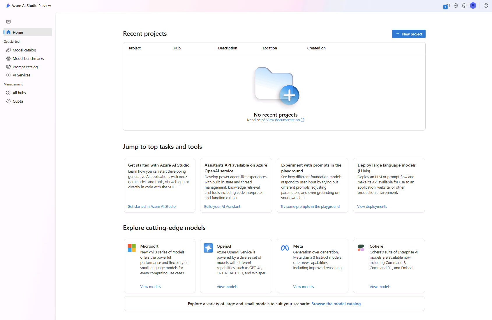
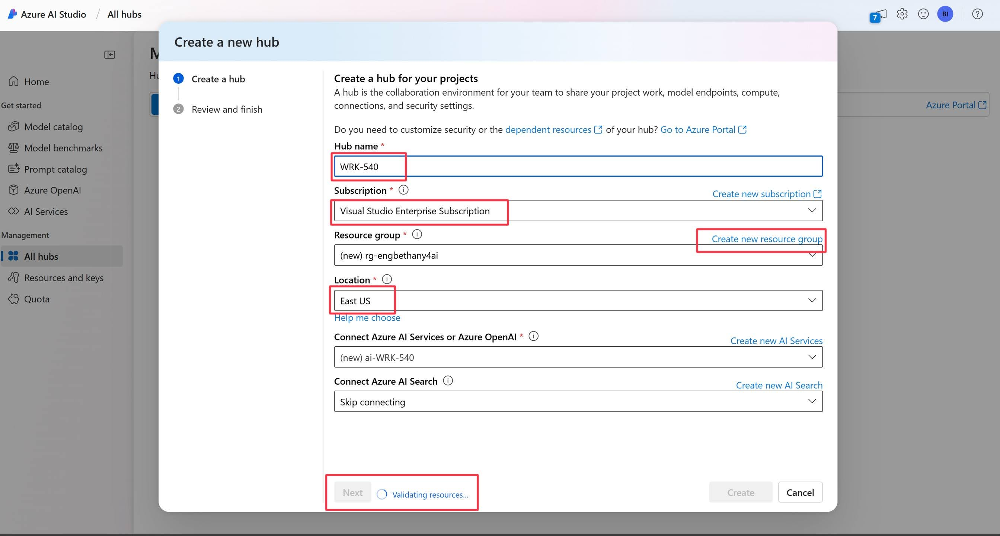
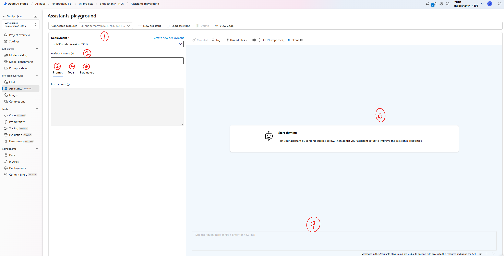
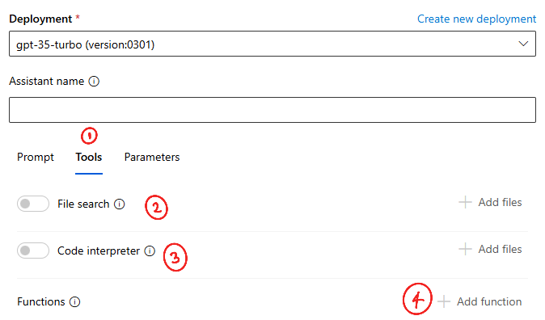
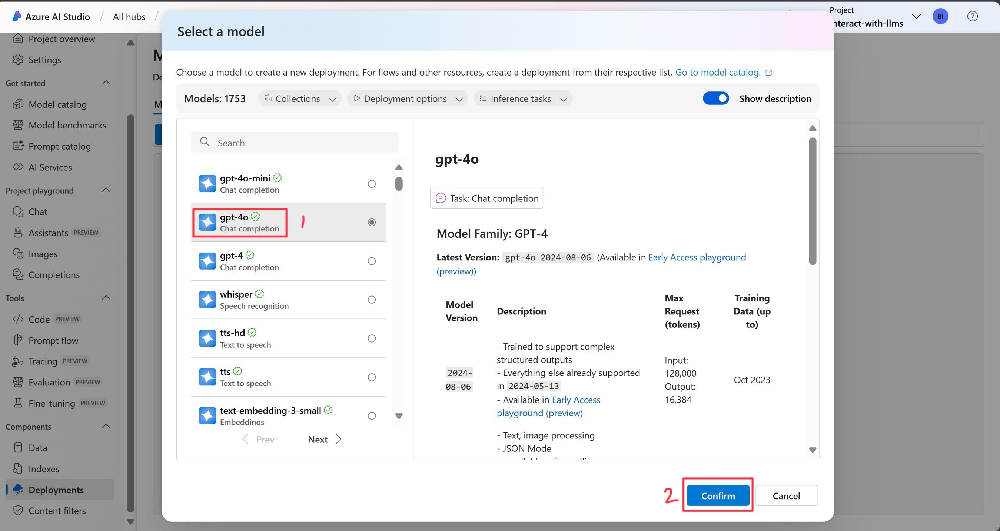
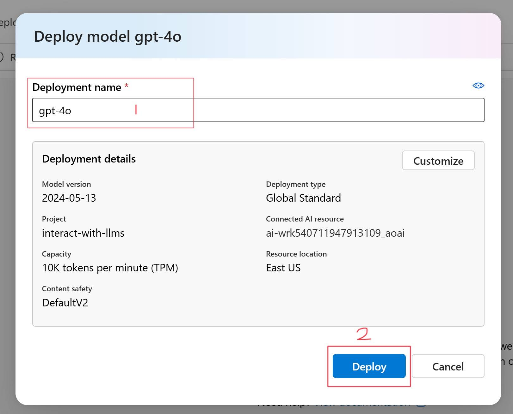
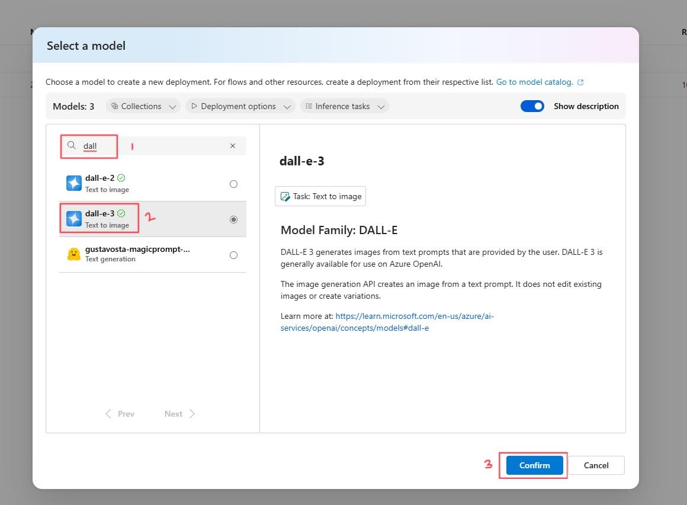

# Get started

> [!TIP]
> What is **Azure AI Studio**? Azure AI Studio is designed for developers to build generative AI applications on an enterprise-grade platform. Developers can interact with their projects code-first via the Azure AI SDK, explore, build, test, and deploy AI models using cutting-edge tooling, and collaborate in a secure environment. The platform supports transforming proof of concepts into production-ready solutions with continuous monitoring and refinement.
   
For this workshop we will be working on Azure AI Studio, especially focusing on the playground feature. We can access Azure AI Studio by opening the Edge Browser and visiting [https://ai.azure.com](https://ai.azure.com?WT.mc_id=aiml-132569-bethanycheum)

## Navigating Azure AI Studio

Let's start by clicking on **Sign In**, you can find the sign in link in the top right of the window, sign in with your account.

Now that we are logged in, we can start navigating around the platform. 

## Creating a new Hub

1. First, click on **All Hubs** under Management on the navigation panel on the left.
2. Then, click on the **+ New Hub** button to create a new Hub. Update the Hub details as follows:

    - Hub Name: **WRK-540**
    - Subscription: **your Azure Subscription**
    - Resource group: click on *create a new resource group*, and name it **interact-with-llms**. 
    - Location: **East US**
    - Leave **Connect Azure AI Services or Azure OpenAI** and **Connect Azure AI Search**

    Once done, click **Next**.

3. On **Review and finish** page, click **Create**.
4. It will take a few minutes to create the resources. Once they are created, you will be redirected to the Hub Homepage.

You will notice a set of elements once we have logged in and land on the Hub Homepage.

### 1. Navigation Panel

On the left side of the screen you will see a navigation panel with a group of different tabs.

- **Current Hub, Hub Overview and All Projects**: This tab provides access to the Hub Overview, and a list of all the projects within the Hub.
- **Get Started**: 
    - *Model Catalog*: The model catalog showcases the available models inside Azure AI Studio. You can click and expand on each model for in-depth description of usage and other details.
    - *Model Benchmarks*: Here you can compare benchmarks across models and datasets available, with charts on accuracy, similarity, fluency, coherence, etc.
    - *Prompt Catalog*: The prompt catalog provides sample prompts for a myriad of common use cases, which can be used to further understand how a model works, and can be customized for specific scenarios.
    - *AI Services*: In the AI Services tab you can see a list of Azure AI Services available, along with demos, use cases and more.

> [!NOTE]
> Azure AI Studio hosts some of the most popular foundation models provided by companies such as Microsoft, Open AI, Hugging Face, Meta and Mistral.

- **Playgrounds**: The Playgrounds represent a fast and accessible way to interact with the models.
- **Shared Resources**: This tab provides access to the resources connected or shared by the AI Hub. Here you can access resources such as the model Deployments, connections to other services, compute instances available in the Hub, user access and content filters applied to our models.

### 2. Hub Overview

On this page, we can see an overview of our Azure AI Studio Hub. This includes the following:

- **Projects**: A project is a resource within Azure AI Studio that grants us access to most of the platform's features, such as the **Playgrounds**. You will notice we have a project created already. This is intentional and we will be working with it in the upcoming sections.
- **Description**: A short description of the Azure AI Studio Hub we are in.
- **Hub Properties**: A collection of various properties such as the Hub's name, its location, resource group, etc. Here we can find useful information such as *API endpoints and keys* and the *subscription's quota*.
- **Connected Resources**: Azure AI Studio allows for multiple resources to be connected to it, expanding its features and functionality. Resources such as Azure AI Search, or in our case, Azure AI Service further increase the capabilities of our Hub, and grant us access to deployments such as LLMs or functionalities such as vector search.
- **Permissions**: Allows us to grant access to collaborators or applications that may need to use the services within the Hub.

## Creating a new Project

 
 
1. On the Hub homepage, click on **+ New project** to create a new project.
2. In the pop up, update your Project name as **interact-with-llms**, then click **Create a project** to create a new project.
3. Once the project is created, click on the Project name to move forward.
 
 

The Project overview page is very similar to the Hub Overview, except the details are tied to the project instead of the Hub that hosts it. 

### Navigation Bar

You will notice the navigation bar has updated with new tabs, which represent functionalities tied to our project. The **Get Started** section remains the same, and **Playgrounds** are expanded to include other versions.

We have two new sections:
- **Tools**: This includes useful opportunities to expand your project's reach, such as ***working in VS Code*** by running a cloud compute, access to [***Prompt Flow***](https://learn.microsoft.com/en-us/azure/ai-studio/how-to/prompt-flow), development of ***Evaluations*** for your models and the ability to carry ***Fine Tuning*** on your deployments.
- **Components**: Here you can add complimentary elements to the project, with resources such as ***Data***, ***Indexes***, ***Deployments*** and ***Content Filters*** to be used as part of your work.

For this lab we will focus on using the **Playgrounds**. Click on the Chat Playground and move on to the next section.

## Project Playgrounds

You will notice we have four options for our **Playground**. Each option represents a different approach to interacting and using AI models, which can be tailored to our specific needs.

We will be carrying most of our work in these Playgrounds, but namely in the following two:

- **Chat Playground**
- **Images Playground**
- **Assistants Playground**

> [!NOTE]
> There is also playground modes designed for various type of scenarios, such as Assistants, Completions and others.

### Chat Playground

1. **Deployment**: This section allows us to change between our deployed models.
1. **System Message Box**: Here is where we enter instructions for the model, previous to the user interaction.
1. **Add your data**: Azure AI Studio supports providing the deployed models with external data, allowing for better search and context.
1. **Parameters**: This tab contains the models detailed settings, such as temperature.
1. **Chat Box**: The chat box is where we will see our interactions with the model in the form of chat messages.
1. **Prompt Box**: This is where we type the prompts we want to send to the model.

### Images Playground

1. **Deployments**: In this drop-down we are able to choose the model to prompt for image generation. These models, just like the chat ones, come from our deployments.
1. **Prompt Box**: Similar to the chat playground's box, this is where the models get their input from the user. In the case of images, descriptions of what we want to generate.
1. **Results Box**: Finally, here is where the generated images are displayed.

### Assistants Playground

1. **Deployments**: In this drop-down we are able to choose the model to prompt for image generation. These models, just like the chat ones, come from our deployments.
1. **Assistant Name**: Here you can give your assistant a name.
1. **Prompt**: Here is where we enter instructions for the model, previous to the user interaction.
1. **Tools**: Here is where you get additional tools to customize your assistant including functions, file search and code interpreter
1. **Parameters**: This tab contains the models detailed settings, such as temperature.
1. **Prompt Box**: Similar to the chat playground's box, this is where the models get their input from the user. 
1. **Results Box**: Finally, here is where the generated images are displayed.

#### Tools in the Assistant Playground

1. **Tools**: Under tools in the Assistants Playground you will find file search, code interpreter and functions.
1. **File Search**: Here you can access your files you have uploaded. Each assistant can have at most 1 vector store attached to it.
1. **Code interpeter**: Code Interpreter allows the Assistants API to write and run code in a sandboxed execution environment. 
1. **Functions**: This allows you to describe the structure of functions to an Assistant and then return the functions that need to be called along with their arguments..

## Model deployment

In this workshop, we will deploy two models: DALL.E 3 and GPT-4o. To deploy the models, follow the following steps:

1. On the Navigation Bar on your left, click on **Deployments.**
2. On the deployments page, click **+ Deploy model** and select **Deploy base model**
3. Search and select **gpt-4o** and click **Confirm** to create a new model.

4. On the new popup, retain the model name as is, then click **Deploy**. Once deployed, go back to the Deployments page.
<!--  -->
5. Click **+ Deploy model** and select **Deploy base model**. Search and select **dall-e-3** and click **Confirm** to create a new model. On the new popup, retain the model name as is, then click **Deploy**.
 
6. Once the models have successfully been deployed, you are now ready to start.

<!--  -->

## Ready to start

That covers the necessary setup and basics of Azure AI Studio. We will now move forward to begin interacting with the models. 

>[!alert] Go back to the **Chat Playground** and move to Part 1: Text Generation
